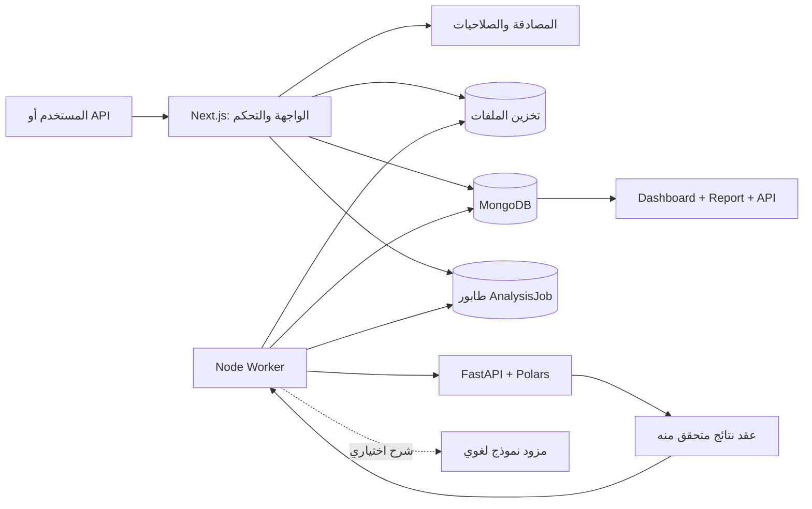

<div dir="rtl" align="right">

# منصة AIDL

## منصة متعددة المؤسسات لتحليل بيانات الأعمال بصورة حتمية وقابلة للتفسير

ارفع ملف البيانات لتحصل على فحص للبنية والجودة، مؤشرات أداء موثقة، اتجاهات
وشذوذات وتوقعات، لوحة معلومات تلقائية، وتقرير تنفيذي.

> **بايثون يحسب، والذكاء الاصطناعي يشرح.**

[English](README.md) · [المعمارية الحالية](docs/ARCHITECTURE.md) ·
[معمارية التوسع المستقبلية](docs/FUTURE_ARCHITECTURE.md) ·
[توثيق API](docs/API.md)

## لماذا AIDL؟

لا ترسل المنصة الصفوف الخام إلى نموذج لغوي كي يخمّن أرقامًا تبدو منطقية.
بدلًا من ذلك:

1. يفحص محرك Python الملف ويحسب النتائج بصورة حتمية.
2. يحمل كل مؤشر مصدره وطريقة حسابه، ولا تعمل الخوارزميات المتقدمة إلا بعد
   اجتياز شروط كفاية البيانات.
3. تُفحص النتيجة بعقد Zod صارم قبل حفظها أو عرضها.
4. يستطيع نموذج لغوي اختياري شرح النتائج المثبتة، لكنه لا ينشئ الأرقام ولا
   يغيّرها.

## أهم المميزات

| المجال | الإمكانات الحالية |
|---|---|
| **رفع البيانات** | CSV وTSV وXLSX وJSON، سحب وإفلات، فحص مبدئي، شريط تقدم حقيقي، والتحقق من المحتوى والحجم قبل التحليل |
| **فهم البيانات** | تسوية JSON المتداخل، استنتاج الأنواع والدلالات والمجال التجاري، ملفات تعريف الأعمدة، واكتشاف مشكلات الجودة والقيم المفقودة |
| **التحليل الحتمي** | KPIs موثقة المصدر، اتجاهات وموسمية، ارتباط Pearson/Spearman، كشف الشذوذ، تقسيم العملاء، وتوقعات لا تظهر إلا عند تفوقها على خط أساس |
| **المخرجات** | لوحة ECharts تُبنى تلقائيًا مع سبب اختيار كل رسم، وتقرير تنفيذي قابل للطباعة إلى PDF |
| **طبقة AI اختيارية** | ضوابط prompt وschema تقيد السرد والأسئلة والأجوبة بعقد النتائج المتحقق منه، مع تشفير مفاتيح مزود AI في قاعدة البيانات |
| **تعدد المؤسسات** | Organizations، وخمسة أدوار، ودعوات أعضاء، والتحقق من العضوية والصلاحيات على الخادم مع عزل البيانات بواسطة `orgId` |
| **خصائص SaaS** | خطط واشتراكات، حصص استخدام ذرية، سجل استهلاك، مفاتيح API محفوظة بالـhash، وفحص الصلاحية وحد الطلبات عند إرسال التحليل، وسجلات تدقيق |
| **المعالجة الخلفية** | تسليم at-least-once عبر MongoDB، وclaim ذري، وheartbeat، وإعادة المحاولة، واستعادة المهام المتوقفة، وعرض تقدم المهمة |
| **واجهة المطورين** | REST API غير متزامنة، متابعة حالة المهمة، جلب النتائج، rate limiting، ومفاتيح idempotency |
| **التشغيل** | PM2 وDocker Compose وhealth/readiness وstructured logs وGitHub Actions CI |
| **اللغة** | واجهة إنجليزية وعربية مع RTL وحفظ اختيار اللغة |

## المعمارية

</div>



<div dir="rtl" align="right">

يتكون المشروع من مستوى تحكم مبني بـNext.js، وعامل خلفي يدير المهام، ومستوى
حساب مستقل مبني بـFastAPI وPolars. يفصل عقد نتائج typed بين الحساب في Python
وبين الحفظ والعرض في TypeScript.

## التقنيات

- **الويب وAPI:** Next.js 15، React 19، TypeScript، NextAuth.
- **قاعدة البيانات:** MongoDB وMongoose.
- **التحليل:** Python 3.12+، FastAPI، Polars، NumPy، SciPy، scikit-learn،
  statsmodels.
- **الرسوم:** Apache ECharts.
- **التخزين:** القرص المحلي أو S3 وR2 وMinIO.
- **التشغيل:** Node worker، PM2، Docker، GitHub Actions، وRedis اختياريًا.

## التشغيل السريع

### المتطلبات

- Node.js 22 أو أحدث.
- MongoDB.
- Python 3.12 أو أحدث.
- بيئة Python افتراضية لخدمة التحليل.

### إعداد متغيرات البيئة

</div>

```bash
git clone https://github.com/mahmoud-adel-dev/multi-tenant-ai-data-analyzer.git
cd multi-tenant-ai-data-analyzer
cp .env.example .env.local
```

```dotenv
MONGODB_URI=mongodb://localhost:27017/aidl-platform
NEXTAUTH_SECRET=<random-secret-at-least-32-characters>
NEXTAUTH_URL=http://localhost:3001
APP_ENCRYPTION_KEY=<64-hex-characters>
```

<div dir="rtl" align="right">

### تثبيت المشروع

</div>

```bash
npm install

cd analytics-service
python -m venv .venv
# Windows
.venv\Scripts\activate
pip install -e ".[dev]"
cd ..
```

<div dir="rtl" align="right">

### تشغيل الخدمات الثلاث معًا

</div>

```bash
npm run dev:all
```

<div dir="rtl" align="right">

بعد الجاهزية:

- الويب: `http://localhost:3001`
- صحة خدمة التحليل: `http://127.0.0.1:8000/healthz`

أوامر الإدارة:

</div>

```bash
npm run dev:all:status
npm run dev:all:logs
npm run dev:all:restart
npm run dev:all:stop
```

<div dir="rtl" align="right">

توجد Dockerfiles وملفات Compose كمرجع للتشغيل والنشر. المسار المحلي الذي تم
التحقق منه هو PM2 أعلاه؛ يحتاج Compose إلى استكمال تحقق البيئة وتهيئة bucket
وعناوين الخدمات الداخلية قبل اعتباره أمر تشغيل واحدًا موثوقًا.

</div>

<div dir="rtl" align="right">

## الاختبارات

</div>

```bash
npm run typecheck
npm test
npm run build
npm run test:e2e:login

cd analytics-service
pytest
```

<div dir="rtl" align="right">

اختبار تسجيل الدخول ينشئ حسابًا ومؤسسة مؤقتين، يمر عبر NextAuth الحقيقي،
يتحقق من الجلسة ولوحة التحكم، ثم يحذف السجلات التي أنشأها فقط.

## نمط التوسع المستقبلي

تتوسع المنصة من خلال منافذ واضحة بدل ربط منطق الأعمال بمزود واحد:

- `StorageProvider` لإضافة مزودي تخزين جدد.
- Queue Port مستقبلي للانتقال التدريجي من Mongo polling إلى BullMQ أو Kafka.
- Analytics Module Registry لإضافة حزم تحليل خاصة بالصناعة.
- AI Provider Adapter لإضافة مزودي نماذج دون تغيير النتائج الحتمية.
- Transactional Outbox لنشر الأحداث دون فقد أو تكرار آثار الأعمال.
- Entitlement Service لربط حدود الملفات والاستخدام بخطة الدفع الفعلية.

التصميم الكامل، مراحل الانتقال، وضوابط عدم كسر النظام الحالي موضحة في
[وثيقة معمارية المستقبل](docs/FUTURE_ARCHITECTURE.md).

## حدود النسخة الحالية

- خصائص السرد وAsk AI تحتاج إلى إعداد مزود نموذج من لوحة الإدارة.
- الاشتراكات تعمل حاليًا بحالة داخلية/manual؛ بوابة الدفع ضمن خطة التوسع.
- تصدير PDF يعتمد على طباعة المتصفح حاليًا.
- تحليل PDF وOCR معطل عمدًا حتى إضافة محرك استخراج حقيقي.
- حد الملف الافتراضي المؤقت 100 MB، وسيُنقل إلى نظام entitlements الخاص
  بخطط الاشتراك.
- تسليم المهام حاليًا at-least-once، كما يُحمّل الملف كاملًا في الذاكرة عند
  عدة حدود؛ منع تكرار آثار النتائج والـstreaming الحقيقي ضمن roadmap واضحة.

## الوثائق

- [المعمارية الحالية](docs/ARCHITECTURE.md)
- [معمارية التوسع المستقبلية](docs/FUTURE_ARCHITECTURE.md)
- [خط معالجة البيانات](docs/DATA_PIPELINE.md)
- [محرك Python](docs/PYTHON_ANALYTICS_ENGINE.md)
- [الأمان](docs/SECURITY.md)
- [تعدد المؤسسات](docs/MULTI_TENANCY.md)
- [API](docs/API.md)
- [التشغيل والنشر](docs/DEPLOYMENT.md)
- [مصفوفة المميزات](docs/FEATURE_MATRIX.md)

---

المبدأ الأساسي للمنصة: **يجب أن تكون أرقام الأعمال قابلة لإعادة الإنتاج قبل
أن تكون قابلة للشرح.**

</div>
