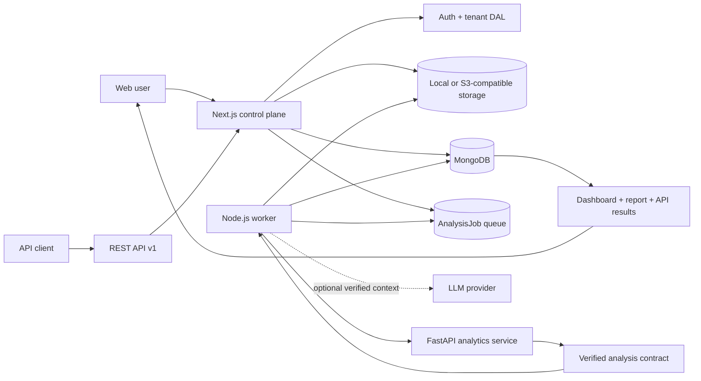
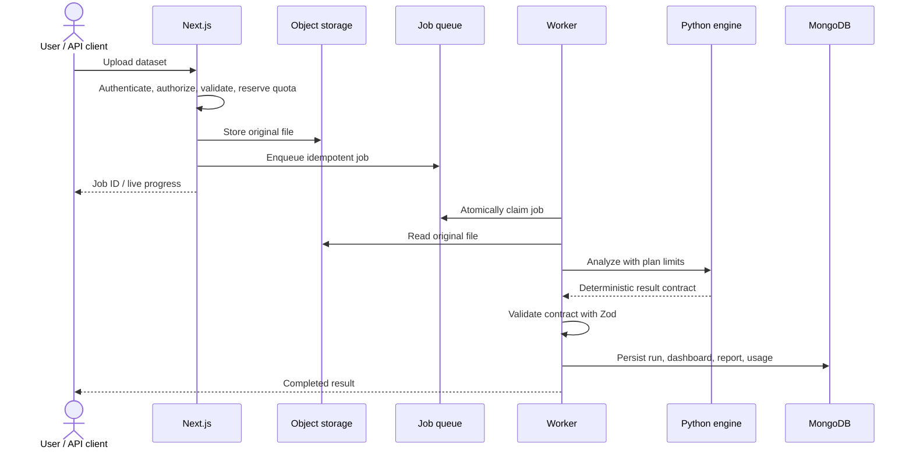

<div align="center">

# AIDL Platform

### Multi-tenant, deterministic data analytics for business teams

Upload a dataset and receive a validated profile, explainable KPIs, trends,
anomalies, forecasts, an auto-generated dashboard, and an executive report.

**Python computes. AI explains.**

[](https://github.com/mahmoud-adel-dev/multi-tenant-ai-data-analyzer/actions/workflows/ci.yml)


[العربية](README.ar.md) · [Architecture](docs/ARCHITECTURE.md) ·
[Future architecture](docs/FUTURE_ARCHITECTURE.md) · [API](docs/API.md) ·
[Security](docs/SECURITY.md)

</div>

---

## Why AIDL?

Most “AI analytics” demos ask a language model to inspect raw rows and invent a
plausible answer. AIDL deliberately separates numerical computation from
narrative generation:

1. A deterministic Python engine validates and analyzes the data.
2. Every KPI carries provenance and every advanced method has eligibility
   checks.
3. A typed contract is validated before any result reaches the database or UI.
4. An optional LLM may explain those verified results, but it never creates or
   changes analytical numbers.

This makes the platform suitable for teams that need convenient analytics
without giving up traceability, tenant isolation, or operational controls.

## Product capabilities

| Area | What the platform provides |
|---|---|
| **Data ingestion** | CSV, TSV, XLSX, and JSON uploads; drag and drop; client preflight; real upload progress; content-aware validation; filename sanitization; parser safety ceilings |
| **Data understanding** | Nested JSON flattening, schema and semantic inference, domain detection, column profiles, missingness and data-quality findings |
| **Deterministic analytics** | Provenance-tagged KPIs, trends and seasonality, Pearson/Spearman correlations, robust anomaly detection, guarded segmentation, and baseline-validated forecasting |
| **Decision outputs** | Auto-planned ECharts dashboards, selection rationale for each widget, adaptive executive reports, methodology, and print-to-PDF support |
| **Optional AI layer** | Prompt and schema guards constrain narrative and dataset Q&A to the verified analysis contract; provider keys are encrypted at rest |
| **Multi-tenancy** | Organizations, five organization roles, invitations, fresh server-side membership checks, active-organization selection, and tenant-scoped data access |
| **SaaS controls** | Plans, subscriptions, atomic quota reservation, usage ledgers, hashed API keys, expiry/rate-limit enforcement on analysis submission, and audit event records |
| **Async processing** | MongoDB-backed at-least-once job delivery, atomic claims, heartbeats, retry/backoff, stalled-job recovery, submission idempotency, and live job progress |
| **Developer API** | Asynchronous REST submission, job polling, analysis retrieval, CORS controls, per-key limits on analysis submission, and idempotency keys |
| **Operations** | Structured logs, health/readiness endpoints, PM2 development orchestration, Docker Compose, production container definitions, and GitHub Actions CI |
| **Localization** | English and Arabic UI dictionaries with persistent locale selection and RTL layout support |

## Architecture at a glance



The repository currently follows a **modular control plane + isolated compute
plane** design. Ports and adapters isolate storage and AI providers, while a
contract boundary isolates Python analytics from TypeScript persistence and
presentation. See [Architecture](docs/ARCHITECTURE.md) for the current system
and [Future Architecture](docs/FUTURE_ARCHITECTURE.md) for planned extension
patterns and scaling stages.

## Analysis lifecycle



## Technology stack

| Layer | Technologies |
|---|---|
| Web and API | Next.js 15 App Router, React 19, TypeScript, NextAuth |
| Persistence | MongoDB, Mongoose |
| Worker | Node.js, esbuild, MongoDB atomic queue |
| Analytics | Python 3.12+, FastAPI, Polars, pandas, NumPy, SciPy, scikit-learn, statsmodels |
| Visualization | Apache ECharts |
| Storage | Local filesystem or S3-compatible services such as AWS S3, R2, and MinIO |
| Optional infrastructure | Redis for distributed rate limiting, PM2 for local orchestration |
| Delivery | Docker, Docker Compose, GitHub Actions |

## Repository layout

```text
multi-tenant-ai-data-analyzer/
├── src/
│   ├── app/                 # Next.js pages, REST routes, and layouts
│   ├── actions/             # Authenticated application commands
│   ├── components/          # Dashboard, charts, admin, and shared UI
│   ├── i18n/                # English/Arabic dictionaries and formatting
│   ├── lib/                 # Auth DAL, queue, storage, AI, validation, logging
│   └── models/              # Tenant-scoped Mongoose models
├── scripts/                 # Worker, migrations, smoke and E2E checks
├── analytics-service/
│   ├── app/                 # Deterministic Python compute plane
│   └── tests/               # Profiling, statistics, pipeline, and API tests
├── tests/                   # TypeScript security, contract, and isolation tests
├── docs/                    # Architecture, security, API, operations, roadmap
└── ecosystem.config.cjs     # PM2 development process definitions
```

## Quick start

### Prerequisites

- Node.js 22 or newer
- MongoDB
- Python 3.12 or newer
- A Python virtual environment with the analytics service installed
- Optional: Redis and S3-compatible storage

### 1. Configure the environment

```bash
git clone https://github.com/mahmoud-adel-dev/multi-tenant-ai-data-analyzer.git
cd multi-tenant-ai-data-analyzer
cp .env.example .env.local
```

Set at least:

```dotenv
MONGODB_URI=mongodb://localhost:27017/aidl-platform
NEXTAUTH_SECRET=<a-random-secret-of-at-least-32-characters>
NEXTAUTH_URL=http://localhost:3001
APP_ENCRYPTION_KEY=<64-hex-characters>
```

Generate secure local values with:

```bash
openssl rand -base64 32
openssl rand -hex 32
```

### 2. Install dependencies

```bash
npm install

cd analytics-service
python -m venv .venv
# Windows: .venv\Scripts\activate
# Linux/macOS: source .venv/bin/activate
pip install -e ".[dev]"
cd ..
```

### 3. Run the complete development stack

```bash
npm run dev:all
```

This starts:

- AIDL web: `http://localhost:3001`
- Analytics health: `http://127.0.0.1:8000/healthz`
- The background analysis worker

Useful lifecycle commands:

```bash
npm run dev:all:status
npm run dev:all:logs
npm run dev:all:restart
npm run dev:all:stop
```

Register at `http://localhost:3001/register`; the application creates the
first organization and owner membership automatically.

### Docker artifacts

Dockerfiles and development/production Compose definitions are included as
deployment references. The verified local path is the PM2 workflow above. The
Compose stack still needs environment-specific validation (including bucket
initialization and internal service URLs) before it should be treated as a
one-command development path; see [Docker documentation](docs/DOCKER.md).

## Validation and tests

```bash
npm run typecheck
npm test
npm run build
npm run test:e2e:login       # requires the local web app and MongoDB

cd analytics-service
pytest
```

The login E2E check creates a uniquely named temporary tenant, authenticates
through the real NextAuth credentials flow, verifies the session and dashboard,
and removes only the records that it created.

## Public API example

```bash
curl -X POST http://localhost:3001/api/v1/analyze \
  -H "Authorization: Bearer <api-key>" \
  -H "Idempotency-Key: upload-2026-001" \
  -F "file=@sales.csv"
```

The endpoint returns `202 Accepted` with a job URL. Poll the job endpoint, then
retrieve the validated analysis contract. See [API documentation](docs/API.md).

## Design principles

- **Deterministic first:** analytical facts come from code, not generated text.
- **Explainability by construction:** methods, evidence, confidence, and
  provenance travel with their outputs.
- **Tenant safety at the server:** UI visibility is never treated as an
  authorization boundary.
- **Fail closed:** malformed files, invalid contracts, missing secrets, and
  exhausted quotas return explicit errors.
- **Replay-safe async work:** submission is idempotent today; durable result
  side effects are being moved toward fully idempotent consumers and an outbox.
- **Replaceable infrastructure:** provider-specific behavior stays behind
  ports so deployment choices can evolve independently.

## Roadmap

| Horizon | Direction |
|---|---|
| Near term | Transactional outbox, browser E2E coverage, malware scanning adapter, Stripe-backed entitlements, OpenTelemetry export |
| Scale-out | Direct multipart object uploads, pluggable BullMQ/Kafka queue adapter, horizontally scaled workers, isolated compute pools |
| Enterprise | SSO/SAML, SCIM, data residency, customer-managed keys, retention policies, fine-grained dataset access |
| Analytics ecosystem | Versioned analytics-module SDK, industry packs, scheduled analyses, governed semantic metrics, webhook/event integrations |

The detailed target design, migration rules, extension interfaces, and
decision gates are documented in
[Future Architecture](docs/FUTURE_ARCHITECTURE.md).

## Current boundaries

- AI narrative and Q&A require an administrator-configured model provider.
- Billing currently supports internal/manual subscription state; payment rails
  are a planned integration.
- Reports use browser print-to-PDF; server-side rendering is a future adapter.
- PDF/OCR ingestion is intentionally disabled until a real extraction engine
  is integrated—AIDL does not fabricate extracted content.
- The temporary default plan allows files up to 100 MB; future billing
  entitlements will own this limit.
- Job delivery is currently at-least-once, and files are materialized in memory
  at several boundaries; crash-safe result aggregation and bounded-memory
  ingestion are explicit roadmap items.

## Documentation

| Topic | Document |
|---|---|
| Current architecture | [docs/ARCHITECTURE.md](docs/ARCHITECTURE.md) |
| Future design and extension patterns | [docs/FUTURE_ARCHITECTURE.md](docs/FUTURE_ARCHITECTURE.md) |
| Data pipeline | [docs/DATA_PIPELINE.md](docs/DATA_PIPELINE.md) |
| Python analytics engine | [docs/PYTHON_ANALYTICS_ENGINE.md](docs/PYTHON_ANALYTICS_ENGINE.md) |
| Dashboard and report engines | [Dashboard](docs/DASHBOARD_ENGINE.md) · [Report](docs/REPORT_ENGINE.md) |
| API | [docs/API.md](docs/API.md) |
| Security and tenancy | [Security](docs/SECURITY.md) · [Multi-tenancy](docs/MULTI_TENANCY.md) · [Authorization](docs/AUTHORIZATION.md) |
| Operations | [Docker](docs/DOCKER.md) · [Deployment](docs/DEPLOYMENT.md) · [Runbook](docs/PRODUCTION_RUNBOOK.md) · [Backup/Restore](docs/BACKUP_RESTORE.md) |
| Product status | [Feature matrix](docs/FEATURE_MATRIX.md) · [Verified MVP status](ANALYTICS_ENGINE_MVP_STATUS.txt) |

---

<div align="center">

Built around one invariant: **business numbers must be reproducible before they
are explainable.**

</div>
