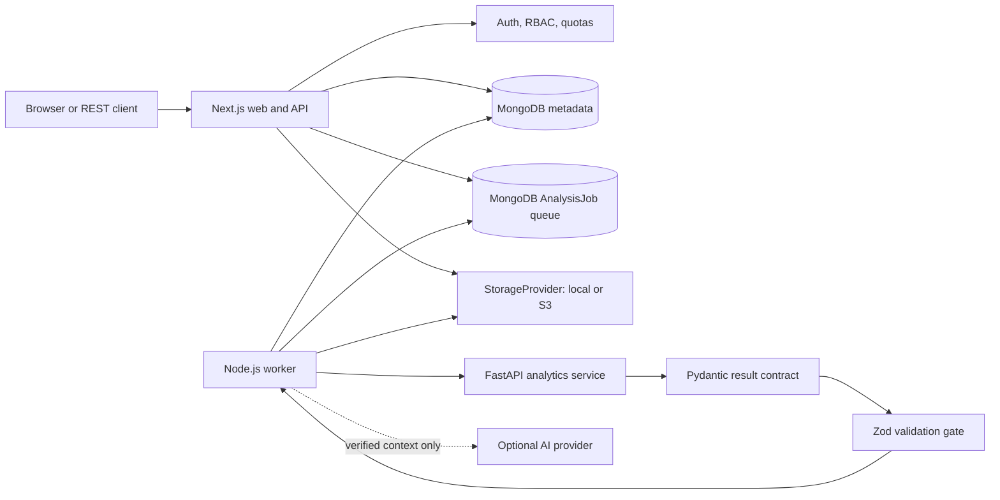
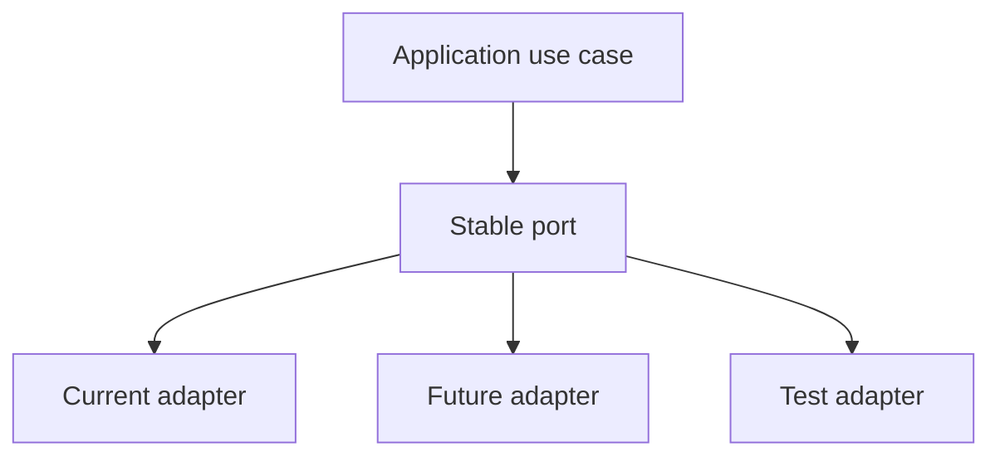
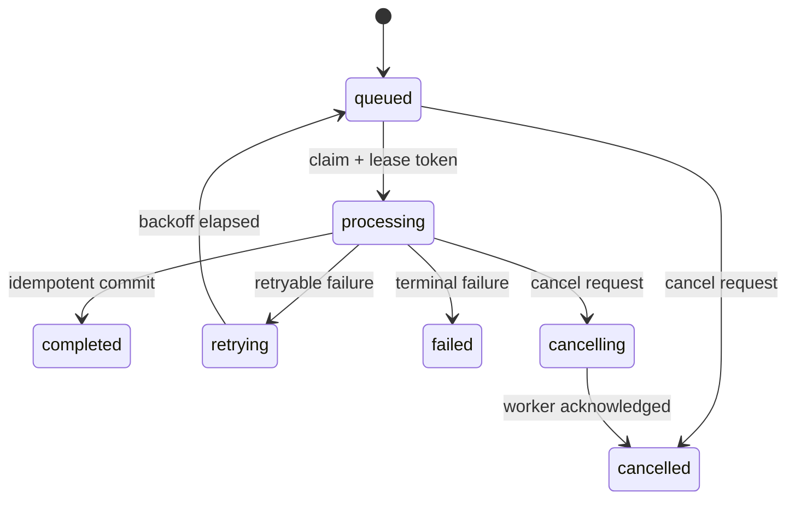
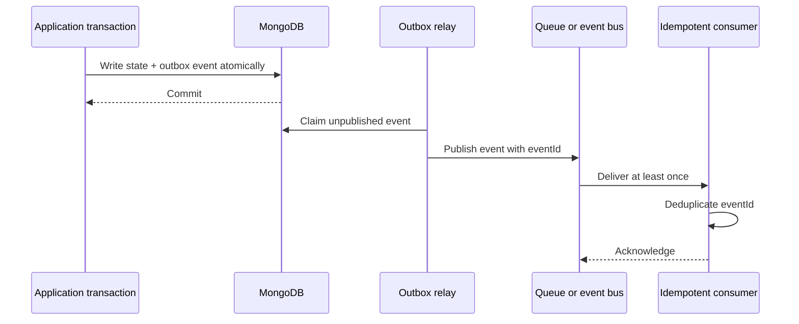
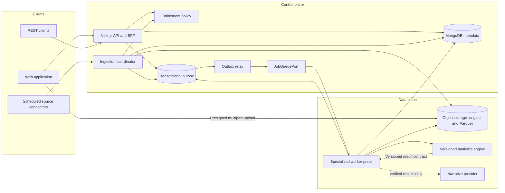
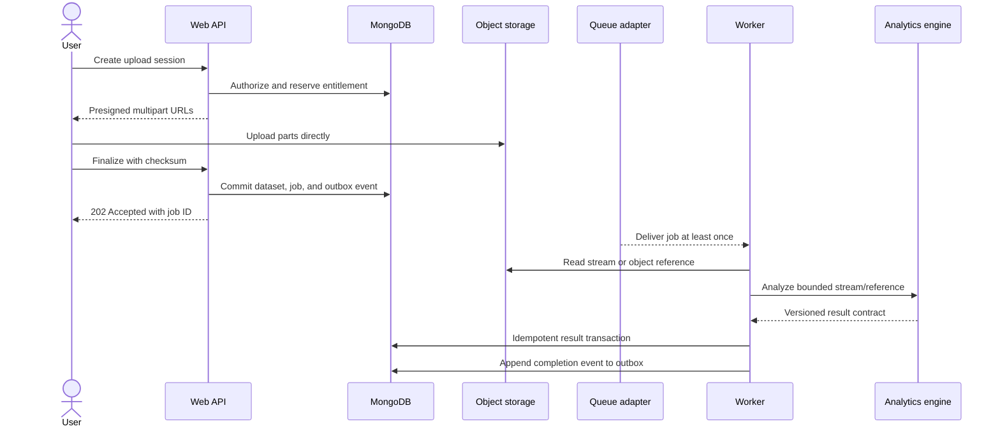
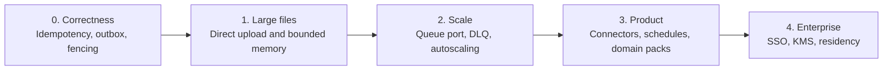

# Future Architecture and Extension Patterns

This document describes how AIDL can grow without replacing the working
platform or weakening its analytical and tenant-safety guarantees.

It deliberately separates three states:

- **Current** — implemented in this repository today.
- **Next** — the next structural change with a concrete operational reason.
- **Future** — a supported direction, not a claim that the feature exists.

The target diagram is a logical architecture. A box is not automatically a
microservice; most modules should stay in the modular monolith until scale,
ownership, isolation, or release cadence creates a measurable reason to split
them.

## 1. Target invariants and non-negotiables

Every evolution must preserve these rules where they are already satisfied and
close the documented gap where the current implementation is still partial:

1. **Python computes; AI explains.** An LLM cannot create or modify analytical
   facts.
2. **Tenant context is resolved server-side.** A client-supplied `orgId` never
   grants access.
3. **Every asynchronous command is idempotent at its durable side effects.**
4. **Results cross a versioned contract boundary** before persistence or UI
   rendering.
5. **Files are untrusted input** until content checks and security scanning are
   complete.
6. **Entitlements are policy, not UI decoration.** The same policy protects
   web uploads, API uploads, storage, rows, jobs, and advanced capabilities.
7. **Infrastructure is replaced behind ports**, not through business-logic
   rewrites.
8. **Scale follows evidence.** A second adapter, an SLO, or a measured
   bottleneck must justify a new abstraction or service.

## 2. Current baseline

AIDL is currently a modular Next.js control plane, a Node.js worker, and an
isolated Python compute service:



### What is already abstracted

- `StorageProvider` separates local and S3-compatible storage.
- The rate limiter selects memory or Redis backends.
- AI calls are isolated from deterministic analytics.
- Pydantic and Zod form a two-sided contract gate.
- The Python planner selects applicable strategies from data evidence.

### Important current constraints

- Job delivery is **lease-based, polling, and at-least-once**. It is not an
  exactly-once system.
- MongoDB queue operations are implemented directly; there is no generic queue
  port yet.
- One worker process handles jobs sequentially. More processes can be started,
  but workload-specific pools are not implemented.
- Upload and analysis currently materialize the file in memory at multiple
  boundaries. Direct multipart upload and end-to-end streaming are future work.
- Worker result persistence spans multiple writes. Crash-safe, idempotent
  result persistence must be completed before aggressive horizontal scaling.
- Billing uses internal/manual subscription state. There is no payment-provider
  adapter yet.
- Job cancellation is represented in the model but is not a complete
  cancellation workflow.

## 3. Design patterns

### 3.1 Modular monolith first

Keep authentication, organizations, plans, dataset metadata, and API behavior
inside the Next.js control plane while boundaries remain clear. Extract a
service only when at least one of these is true:

- it needs an independent scaling profile;
- it handles a different trust boundary;
- a separate team owns its release lifecycle;
- failure isolation is required by an SLO;
- its runtime or data model is materially different.

The Python analytics service already satisfies the runtime and scaling reasons
for separation.

### 3.2 Ports and adapters

Business workflows depend on small interfaces; deployment-specific code
implements them.



| Port | Current adapter | Possible future adapters | Add when |
|---|---|---|---|
| `StoragePort` | Local, S3-compatible | Azure Blob, Google Cloud Storage | A customer or deployment requires another object store |
| `RateLimitPort` | Process memory, Redis | Managed gateway limiter | Limits move to an edge/API-gateway tier |
| `JobQueuePort` | Direct Mongo lease queue | BullMQ, SQS, RabbitMQ | Queue depth/SLO data shows Mongo polling is the bottleneck |
| `NarrativeProvider` | OpenAI-compatible HTTP | Azure OpenAI, local model, tenant provider | A second provider is required |
| `NotificationPort` | In-app Mongo notifications | Email, Slack, webhook | A real external delivery channel is added |
| `BillingProvider` | Manual internal state | Stripe, Paddle | Payment collection is activated |
| `ReportRenderer` | Browser print | Server PDF, scheduled delivery | Automated exports become a product requirement |
| `TelemetryPort` | Structured logs | OpenTelemetry, Prometheus, Sentry | An observability backend is selected |

Do not create empty interfaces for every row today. Introduce a port when a
second adapter or a concrete testing/operational need exists.

### 3.3 Contract boundary

The analytics response is an API between runtimes, even when both services are
deployed together.

Next steps:

- add an explicit `contractVersion`;
- maintain compatibility fixtures for supported versions;
- reject unknown major versions;
- allow additive minor-version fields;
- store engine and contract versions with every analysis run;
- keep migrations at the boundary instead of scattering compatibility logic
  throughout the UI.

### 3.4 State machine with lease fencing

Job status should evolve from enum values to guarded transitions:



Each claim receives a monotonically increasing fencing token. A stale worker
cannot commit after its lease has expired and a newer worker has claimed the
job.

### 3.5 Transactional outbox

Database state and external events cannot be committed atomically without a
bridge. The outbox pattern writes the business change and an event record in
one MongoDB transaction. A relay publishes pending events to a queue or
delivery adapter.



Use the outbox for notifications, metering, audit export, webhooks, and future
connectors. It turns retries from an implicit hazard into an explicit delivery
contract.

### 3.6 Idempotent consumer and result aggregate

An analysis job should have one durable result aggregate keyed by `jobId`:

- unique `jobId` on `AnalysisRun`;
- deterministic IDs or upserts for Dashboard and Report;
- usage ledger events keyed by the job and metric;
- a transaction around the final result aggregate where supported;
- repeated completion calls return the previously committed result;
- notifications deduplicate by event ID.

Success criterion: terminating the worker at every persistence step and then
retrying cannot produce duplicated results, usage, or notifications.

### 3.7 Saga and compensating actions

Upload touches quota, storage, dataset metadata, and a job. Until all resources
share a transaction, model the workflow as a saga with named compensations:

| Forward action | Compensation |
|---|---|
| Reserve job quota | Release job quota |
| Reserve storage bytes | Release storage bytes |
| Create dataset metadata | Delete the exact dataset by generated ID |
| Store original object | Delete the exact object key |
| Append upload usage | Delete/reverse the exact idempotent ledger entry |

Every compensation must be safe to call more than once.

### 3.8 Strategy and module registry

The Python engine already selects analytical methods based on evidence. Future
domain packs should formalize that behavior behind a versioned stage contract:

```python
class AnalysisStage(Protocol):
    key: str
    version: str

    def eligible(self, profile, semantics, plan) -> Eligibility: ...
    def run(self, frame, context) -> StageResult: ...
```

A registry may then support sales, finance, operations, HR, and customer packs
without allowing arbitrary tenant code inside the trusted engine. Each pack
must declare inputs, minimum evidence, outputs, resource limits, and tests.

### 3.9 Bulkhead, timeout, and circuit breaker

Separate resource budgets for:

- parsing and profiling;
- statistical/ML analysis;
- optional AI narrative;
- external source connectors;
- notification delivery.

An AI outage must not fail deterministic analysis, and one oversized workbook
must not consume every worker slot. Timeouts and retry budgets should be owned
by the relevant adapter, with terminal errors mapped to stable application
codes.

### 3.10 Strangler migration

Major infrastructure changes should run behind the same port:

1. wrap the current Mongo queue as the first `JobQueuePort` adapter;
2. add metrics and contract tests;
3. implement the candidate adapter;
4. mirror or canary a small workload;
5. compare correctness, latency, cost, and operations;
6. migrate gradually;
7. remove the old adapter only after rollback is no longer required.

This avoids a high-risk queue rewrite.

## 4. Target logical architecture



## 5. Large-file ingestion target

The current 100 MB product limit is acceptable, but multiple full-buffer copies
increase memory pressure. Large-file support should evolve as follows:



Additions required:

- resumable presigned multipart uploads;
- checksum verification on finalize;
- quarantine and malware scanning before `READY`;
- a normalized Parquet artifact so repeated analyses do not reparse originals;
- stream/object-reference ingestion in the compute plane;
- centralized entitlement checks for file, storage, row, and compute limits.

## 6. Roadmap and decision gates

### Phase 0 — correctness under retry

Build before increasing worker concurrency:

- version the analysis contract;
- make the result aggregate idempotent by `jobId`;
- add lease fencing;
- implement transactional outbox and idempotent consumers;
- complete cancellation transitions;
- add crash-point integration tests.

**Exit gate:** killing a worker at every boundary and replaying the job produces
one result, one usage effect, and one user notification.

### Phase 1 — efficient large files

- direct multipart object uploads;
- malware scan/quarantine adapter;
- streaming or object-reference compute requests;
- reusable normalized Parquet artifacts;
- one entitlement policy used by web and REST uploads.

**Exit gate:** a resumable 100 MB upload does not require a 100 MB copy in each
Node and Python process, and a failed finalize releases quota safely.

### Phase 2 — operational scale

- introduce `JobQueuePort` with the Mongo adapter first;
- add dead-letter handling and admin replay;
- split queues by workload and plan tier where measurements justify it;
- autoscale workers from queue depth and processing duration;
- export metrics and distributed traces;
- adopt BullMQ, SQS, or another broker only after a benchmark and rollback
  plan.

**Exit gate:** documented SLOs hold under the target concurrency, and a queue
adapter can be changed without changing analysis use cases.

### Phase 3 — product extensions

- scheduled analyses and source connectors;
- dataset versions and schema evolution;
- incremental ingestion;
- governed `AnalysisStage` registry and domain packs;
- webhook, email, and scheduled-report adapters;
- payment provider plus idempotent webhook processing.

**Exit gate:** each extension uses a versioned port and includes tenant,
idempotency, quota, audit, and failure-mode tests.

### Phase 4 — enterprise controls

- SSO/SAML and SCIM;
- KMS envelope encryption and key rotation;
- configurable retention, legal hold, and audit export;
- data residency and dedicated compute pools;
- fine-grained dataset permissions above organization RBAC;
- disaster-recovery drills with measured RPO/RTO.

**Exit gate:** controls are testable and auditable rather than configuration
claims.



## 7. Cross-cutting extension checklist

Every new provider, connector, analysis stage, or worker type must answer:

- **Tenancy:** where is `orgId` resolved and enforced?
- **Authorization:** which role or API-key scope is required?
- **Entitlements:** which limits are reserved and when are they released?
- **Idempotency:** what key deduplicates commands and side effects?
- **Contract:** which version owns input and output validation?
- **Security:** how are credentials encrypted, rotated, and redacted?
- **Observability:** which correlation IDs, metrics, traces, and alerts exist?
- **Failure behavior:** which errors retry, compensate, dead-letter, or stop?
- **Data lifecycle:** where are retention, deletion, export, and residency
  enforced?
- **Testing:** what proves isolation, replay safety, and compatibility?

An extension is not complete until these answers are encoded in tests or
operational checks.

## 8. Architecture decision records

Material changes should add a short ADR under a future `docs/adr/` directory.
An ADR should contain:

1. context and measured problem;
2. decision and alternatives;
3. tenant/security implications;
4. data migration and rollback;
5. cost and operational impact;
6. success metrics;
7. compatibility window.

Recommended first ADRs:

- `0001-job-delivery-semantics.md` — at-least-once contract and fencing;
- `0002-transactional-outbox.md` — event publication and deduplication;
- `0003-large-file-ingestion.md` — multipart upload and normalized artifacts;
- `0004-queue-port.md` — evidence required before changing queue technology;
- `0005-entitlement-policy.md` — subscription limits as one server-side policy.

## 9. What not to do

- Do not split every module into a network service.
- Do not call at-least-once processing “exactly once.”
- Do not add Kafka because future scale is merely possible.
- Do not allow plugins to execute arbitrary tenant code in the trusted compute
  process.
- Do not let billing webhooks directly mutate access without idempotency and
  signature verification.
- Do not bypass the analytics contract for “temporary” dashboard fields.
- Do not increase upload limits without validating memory behavior across the
  complete request path.

## 10. Definition of architectural progress

The platform has evolved successfully when it can add providers, workloads,
and enterprise controls through explicit interfaces while retaining:

- reproducible numbers;
- tenant isolation;
- bounded failure domains;
- replay-safe side effects;
- versioned contracts;
- observable operations;
- reversible migrations.

That is the purpose of these patterns—not additional complexity for its own
sake.
